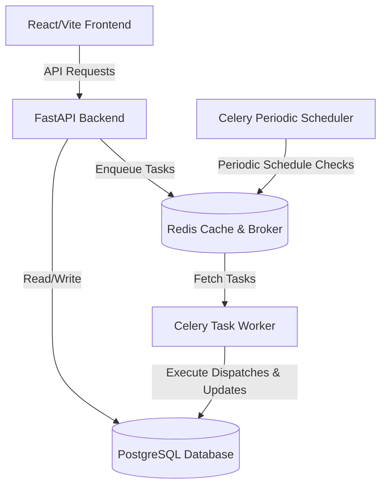
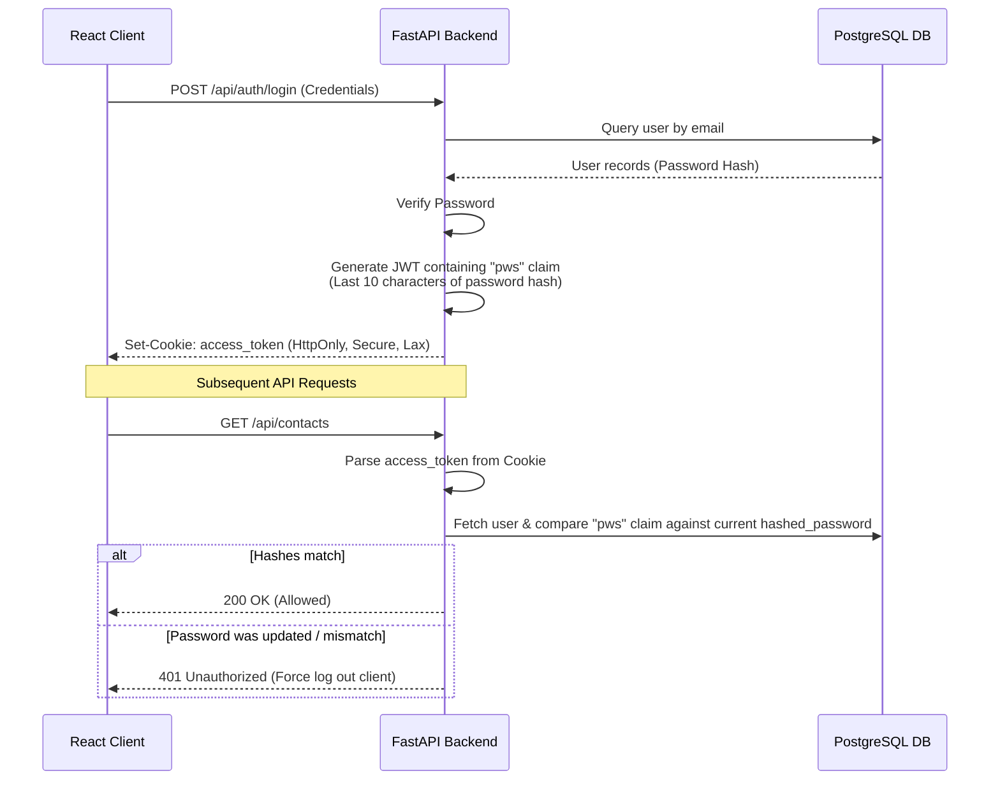
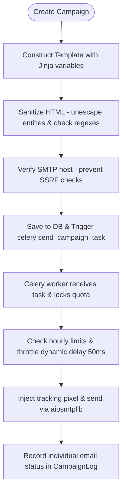

# SmartCampaign SaaS — End-to-End System Workflow

This document outlines the detailed technical workflow, component relationships, and security lifecycles of the SmartCampaign SaaS platform.

---

## 1. System Architecture & Components

SmartCampaign is structured around six core services operating in a containerized Docker network:

---

## 2. Authentication & Security Verification Flow

SmartCampaign utilizes stateless HttpOnly JWT authentication backed by database password signature checks to support session revocation:

---

## 3. SaaS Subscription & Account Lockout Lifecycle

The system enforces automated subscription state checks through real-time API intercepts and a Celery sweeper:

1.  **Registration**: New accounts receive the `"trial"` tier, with `quota_limit = 5000` and `subscription_expires_at` set to exactly `now + 15 days`.
2.  **Hourly Sweeper Tasks**:
    *   `Celery Beat` runs `deactivate_expired_subscriptions_task` every 10 minutes.
    *   The task queries PostgreSQL for any user where `subscription_expires_at <= current_time` and `subscription_tier != "expired"`.
    *   Matching accounts are automatically downgraded: `subscription_tier = "expired"`.
3.  **Active Gated Enforcement**:
    *   API routes require the `verify_active_subscription` dependency.
    *   If `user.subscription_tier == "expired"`, a `403 Forbidden` response with the body `{"detail": "SUBSCRIPTION_EXPIRED"}` is returned.
    *   The frontend fetch interceptor catches this response, locks sidebar elements (🔒), and redirects the user to `/billing?expired=true`.
    *   Billing and Wallet features remain accessible to allow users to upgrade/renew.

---

## 4. Email Campaign Dispatch Pipeline

The workflow of creating and delivering email campaigns:

---

## 5. SMS Marketing Dispatch Pipeline

SMS campaigns leverage comma-separated bulk dispatch models for faster delivery:

1.  **Selection**: The user selects a gateway (BulkSMSBD, Twilio, or Vonage) and selects/inputs recipient phone numbers.
2.  **API Verification**: The system queries the provider credentials and requests the active credit balance.
3.  **Bulk Dispatch**:
    *   For twilio and vonage, individual Celery tasks are enqueued.
    *   For BulkSMSBD, the backend formats a single POST request containing all comma-separated numbers and transmits it to the provider.
4.  **Logging**: The BulkSMSBD API responds with status codes. The backend processes the payload and performs a single bulk-insert write to PostgreSQL (`SMSLog` table) to record the status.

---

## 6. Super Admin Center Diagnostics Loop

The administrative command center tracks system health dynamically:

1.  **Admin Impersonation / Login**: Validates credentials time-safely using `secrets.compare_digest`.
2.  **Diagnostics Queries**:
    *   Ping-tests the Redis instance to measure transaction latency.
    *   Queries active Celery worker nodes to audit registered tasks.
    *   Queries hardware metrics (CPU/RAM) from the OS level.
3.  **Maintenance Mode**:
    *   If active, the global middleware intercepts public requests and returns `503 Service Unavailable`, protecting database transactions during upgrades.
