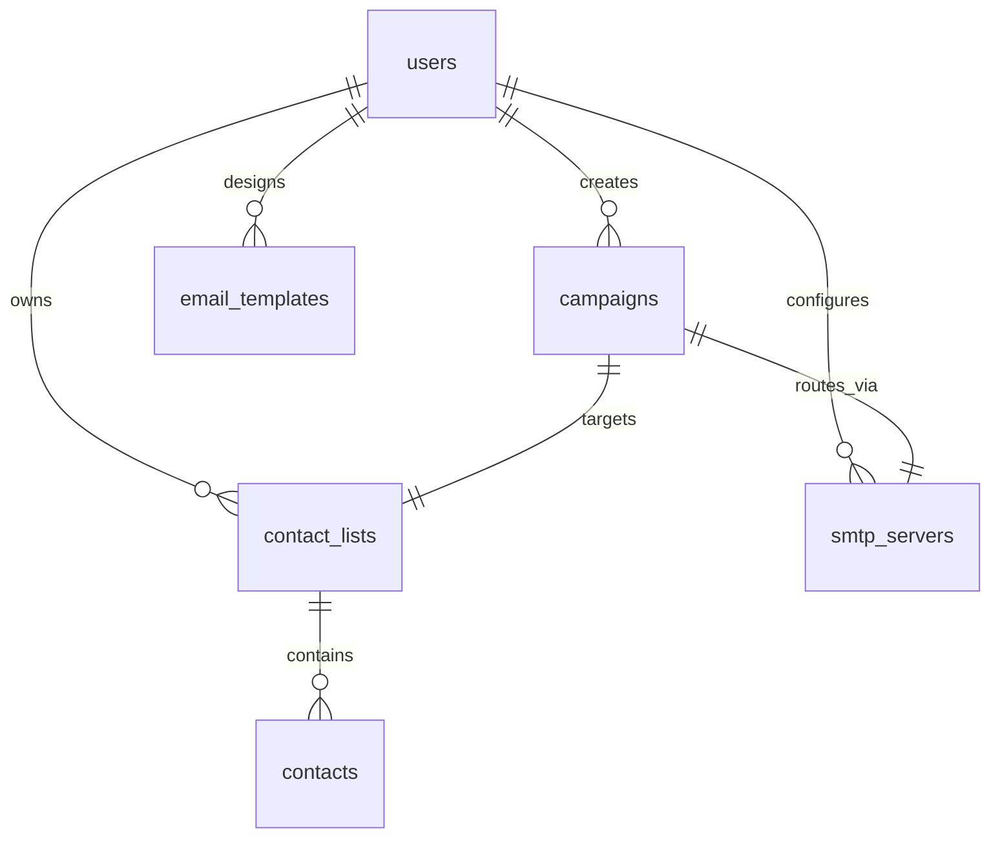

# SmartCampaign — Database Design Features Documentation

This document describes the schema architecture, entity relationships, and Docker data persistence strategy of the **SmartCampaign** platform.

---

## 1. Database Entity Schema
SmartCampaign uses a relational PostgreSQL database. The core tables and their fields include:

### A. User Management
* **`users`**: Main portal user accounts.
  * Fields: `id` (PK), `email`, `hashed_password`, `quota_limit`, `quota_sent`, `subscription_tier`, `subscription_expires_at`, `is_active`, `created_at`.
* **`admin_users`**: Administrative accounts.
  * Fields: `id` (PK), `email`, `hashed_password`, `role` (e.g. `master_admin`), `is_active`, `created_at`.

### B. Marketing Data & Resources
* **`contact_lists`**: Groupings of contacts.
  * Fields: `id` (PK), `name`, `user_id` (FK), `created_at`.
* **`contacts`**: Recipient records.
  * Fields: `id` (PK), `email`, `first_name`, `last_name`, `extra_data` (JSON), `list_id` (FK), `created_at`.
* **`email_templates`**: Saved email layout templates.
  * Fields: `id` (PK), `name`, `subject`, `content_html`, `user_id` (FK), `created_at`.
* **`smtp_servers`**: Mail transfer agent configurations.
  * Fields: `id` (PK), `host`, `port`, `username`, `hashed_password` (Fernet encrypted), `user_id` (FK), `is_active`.
* **`campaigns`**: Individual marketing campaign dispatches.
  * Fields: `id` (PK), `name`, `subject`, `sending_mode` (`manual` / `auto`), `contact_list_id` (FK), `smtp_server_id` (FK), `user_id` (FK), `status`, `created_at`.

### C. System Configs & Diagnostics Logs
* **`system_configs`**: Synchronized administrative global settings.
  * Fields: `id` (PK), `site_name`, `support_email`, `maintenance_mode`, `global_send_rate_limit`, `api_listener_enabled`, `api_listener_username`, `api_listener_access_key`, `extra_settings` (JSON for invoice, TAX, localization).
* **`dhru_api_logs`**: Logs for third-party Dhru bridge API activity.
* **`payment_logs`**: Log entries verifying EVM/TRC20 transaction details.

---

## 2. Entity Relationship Structure


---

## 3. Data Persistence Strategy
To prevent database data loss during system updates, we employ a dual-persistence strategy:

### Local Development Environment
In the local `docker-compose.yml` file, a bind mount is used:
```yaml
db:
  volumes:
    - ./pgdata:/var/lib/postgresql/data
```
* **Why**: Allows developers to easily inspect, back up, or modify the database files on their local hard drive.

### Production Environment (Coolify)
In the production `docker-compose.prod.yml` configuration, a Docker Named Volume is defined:
```yaml
db:
  volumes:
    - pgdata:/var/lib/postgresql/data

volumes:
  pgdata:
    driver: local
```
* **Why**: Docker named volumes are managed by the Docker engine daemon outside of the repository directory. They persist across all container rebuilds, cache clears, or force redeploys, ensuring live data is never wiped.
